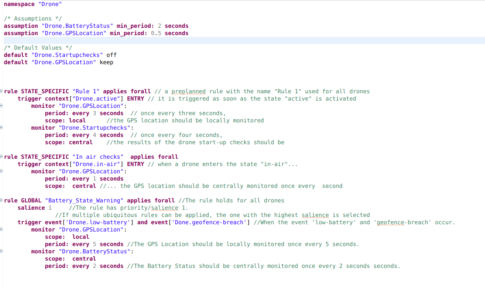

# AMon Domain-Specific Monitoring Adaptation Language

To facilitate the specification of adaptation rules for a runtime monitoring environment, we created a domain-specific language that provides capabilities for defining different types of adaptation rules and specifying assumptions about the monitoring data.

We include two types of rules:

- **STATE-SPECIFIC Rules**  that are triggered based on specific states of the system, or of its devices (e.g., a UAV being in a "takeoff" state versus "flying")
- **GLOBAL Rules** that are triggered by exceptions (e.g., a low battery warning) or other factors.

In addition to the specification of rules, we also support the description of 
- **Assumptions** about the system and its environment.
- **Default Values**

## Example DSL V2: 

 - [Dronology Rules (Xtext)](examples/drone_v2.mondsl)

## Grammar

[XText DSL File](Dsl.xtext)
